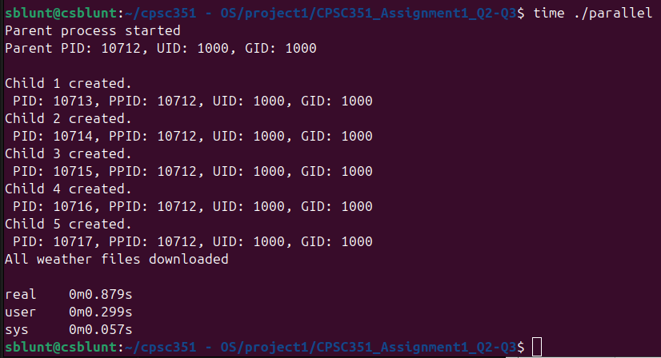

# CPSC351_Assignment1_Q2/Q3

## Names / Emails:
- Josh Navarro: joshpatnav@csu.fullerton.edu
- Monica Soliman: msoliman14@csu.fullerton.edu
- Isaac Morrell: isaacmorrell13@csu.fullerton.edu
- Spencer Blunt: sblunt3@csu.fullerton.edu
- Michelle Pineda: pinedama@csu.fullerton.edu
- Mathew Estrada: mestrada145@csu.fullerton.edu

## Contribution
Josh and Monica completed question one problems. Matthew completed question 2 files. Josh and Isaac completed problem 3 files. Spencer, Monica, and Michelle completed problem 3 questions and the readme.
## Statement
We all understand and are familiar with the functionality in the assignment

## Programming Language
C++

## How to Execute
For serial use: 
*to compile*
g++ serial.cpp -o serial
*to run program*
./serial
*to get time outputs*
time ./serial

For parallel use:
*to compile*
g++ parallel.cpp -o parallel 
*to run program*
./parallel
*to get time outputs*
time ./parallel

## Execution Times
For serial our execution times are:
>real	0m4.118s
>user	0m0.309s
>sys	0m0.050s

For parallel our execution times are:
>real	0m0.879s
>user	0m0.299s
>sys	0m0.057s

## Questions/Answers
1. In the output of time, what is the difference between real, user, and sys times?

Answer: 
Real time: The total time it will take for the program to run from start to finish.
User time: Is how long the CPU spends running the program’s own code.
Sys time: The time the CPU spends doing work for the program inside the operating system, like handling files or input and output.

2. Which is longer: user time or sys time? Use your knowledge to explain why.

Answer:
User time and system times will relatively be the same, it comes down to the level of privilege the instruction a process has. User mode will deal with all non-privileged instructions and the system will execute all privileged instructions. Ideally processes should be granted the minimum privileges needed for their tasks, meaning we hope to spend more time in user mode. This means our processes will have less of a chance to potentially damage the system. Our time ./serial output and time ./parallel reflect this. Our user time for serial is 0.259s greater than system, with our user time being 0.309s and system being 0.050s, and for parallel our user time is 0.242s greater than system with our user time being 0.299s and our system time at 0.057s.

3. When fetching all of the locations in the file, which fetcher finishes faster? Why do you think
that is?

Answer: When fetching all of the locations in the file, the Parallel Fetcher would fetch through all of the locations in the file faster. Overall the parallel fetcher executes the fastest. It takes the parallel fetcher 0.879s to run, while the serial fetcher takes 4.118s. In the end the run time of the parallel fetcher to go through the all the locations would be complete before the serial fetcher.

4. Suppose one of the fetcher children crashes. Will this affect other children? Explain. What
is your conclusion regarding the benefits or disadvantages of isolating each fetch task within
a different process?

Answer:
If one of our fetcher children processes were to crash, it would not affect our other children processes. Each child process runs independently of each other, so the state of one will not impact the others, only the parent process will be able to affect the children. The only way a child crashing could affect another, is if they shared any sort of memory or passed data from one another. This is a benefit to us as isolating each fetch to a process allows the rest of our children to continue executing as normal and lowers the chance of children processes potentially becoming orphaned or zombies.

